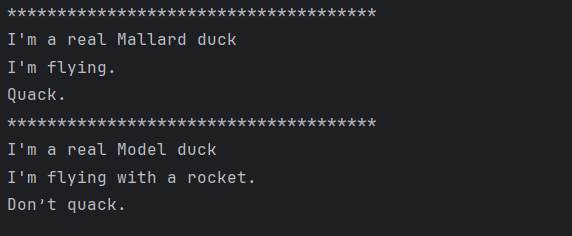
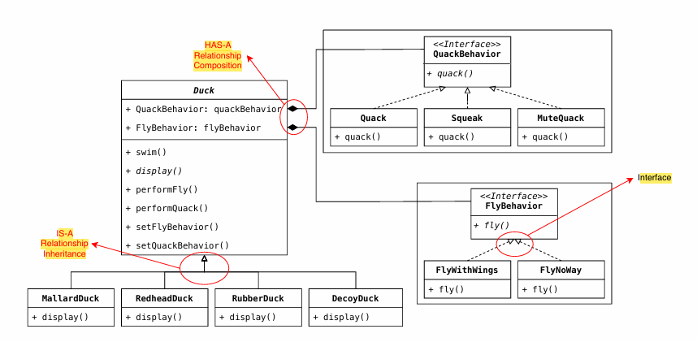

# Strategy Pattern: 

> Behavioral pattern 

> Define a family of algorithms, encapsulate each one, and make them
interchangeable.

> Every duck has not a same features. Some ducks can fly and quack,
> some ducks can not fly and quack. 

> If we inherit duck class for these ducks, system will be complex and unchangeable.
> So, We can use **Strategy Pattern**. 

> In Strategy Pattern, There is no inheritance, there is composition. 

``` 
public abstract class Duck {
    FlyBehavior flyBehavior;   // Composition 
    QuackBehavior quackBehavior;  // Composition

    public void setFlyBehavior(FlyBehavior flyBehavior) {
        this.flyBehavior = flyBehavior;
    }

    public void setQuackBehavior(QuackBehavior quackBehavior) {
        this.quackBehavior = quackBehavior;
    }

    public void performQuack() {
        quackBehavior.quack();
    }

    public void performFly() {
        flyBehavior.fly();
    }

    public Duck() {
    }

    public abstract void display();

    public void swim() {
        System.out.println("I am swimming.");
    }
} 
```

> We use interfaces directly into the our abstract calls. --> composition

> Output of this code : 
> 

> 